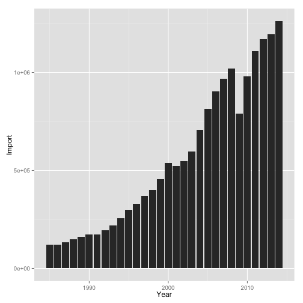

Explore US - Trade Ballance
========================================================
author: Stanislav Georgiev
date: Jul-25-2015

Who does US trades with? How much?
========================================================

The goal of this application is to provide interactive tool to settling down important convesations around who does the US trades with!

- Our neightbours - Mexico & Canada are top


Lets review a sample of the data to be more familiar
========================================================


```
   Year Country   Import   Export
1  1985  Canada  69006.4  47251.0
2  1986  Canada  68252.7  45332.5
3  1987  Canada  71084.9  59814.3
4  1988  Canada  81398.0  71622.0
5  1989  Canada  87953.0  78808.9
6  1990  Canada  91380.1  83673.8
7  1991  Canada  91063.9  85149.8
8  1992  Canada  98629.8  90594.3
9  1993  Canada 111216.4 100444.2
10 1994  Canada 128405.9 114438.6
11 1995  Canada 144369.9 127226.0
12 1996  Canada 155892.6 134210.2
13 1997  Canada 167234.1 151766.7
14 1998  Canada 173256.0 156603.5
15 1999  Canada 198711.1 166600.0
```


Sample plot (try the App for more!)
========================================================

 

